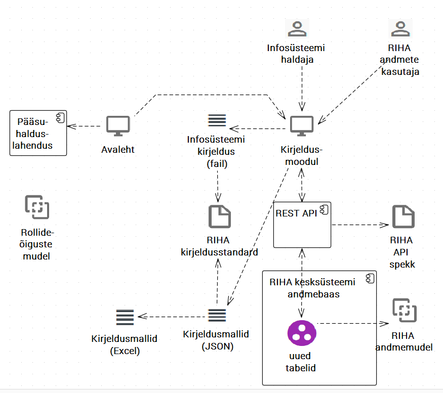

# Kirjeldusmoodul. Ülevaade

- Kirjeldusmoodul on RIHA üks nähtavamaid komponente. Mooduli võimalused:
  - inimkasutaja saab leida, vaadata, lisada, muuta ja hallata (ümber nimetada, kustutada) RIHA andmekirjeldusi
  -	kirjelduste lugemine RIHA andmebaasist ja sinna tagasi kirjutamine REST liidese abil
  - kirjelduste lugemine ja kirjutamine ka failist (faili)
  - kirjeldamise tüürimine mallide abil
  -	andmete vaatamine külalise režiimis; muud tegevused vastava õiguse olemasolul.
 
 ## Hinnang tehtule
 
 - Tehnoloogia
   - valitud on aktuaalne, üheks parimaks peetav tehnoloogiapinu (_stack_)
     - React, _Javascripti-põhine UI raamistik_
     - Gulp, _ehitamise automatiseerimisvahend_
     - Babel, _Javascripti versiooniteisendaja_
   - tuleb arvestada, et valitud tehnoloogiad, sh Javascript arenevad väga kiirelt. Seetõttu vajab tarkvara kasutatavuse ja paindlikkuse tagamiseks iga-aastast hooldust
   - mallidega tüürimine on teostatud; mallid tehakse kahes järgus, kõigepealt Exceli tabelina; seejärel Perl rakendus tõlgib Excelist JSON-isse
     - mallid osutusid mahukaks (5000+ JSON rida); soovi korral saaks JSON malle otse redigeerida, jättes Exceli järgu ära
     - mallide muutmist (versioneerimist) ei ole katsetatud; mallidesse puutuv on ka ebapiisavalt dokumenteeritud
 
 ## Tööde plaan
 
 - Dokumentatsiooni kordategemine
 - Kujunduse vahetamine - EELDUS: Uus kujunduslahendus
 
 ## Arhitektuurijoonis
 
 
 
