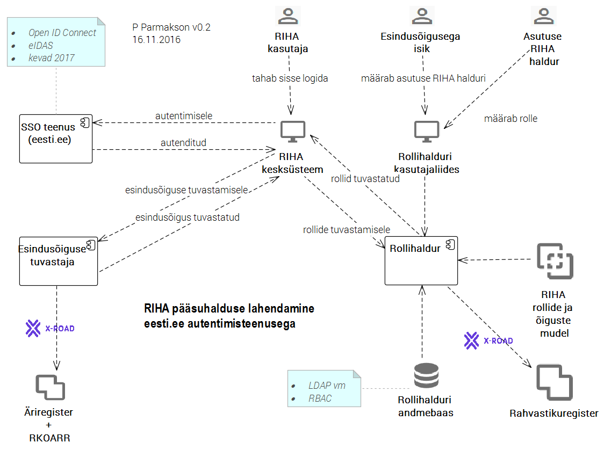

MÄRKUSED

16.11.2016 tutvustus H-le:
- LDAP tundub hea; OpenLDAP pole kõrgkäideldavuse seisukohalt parim;
- selgitada, kas eesti.ee autentimisteenuse lubadusele saab tugineda 
- Esindusõiguse kontrollija p.o Rollihalduri küljes

---

# RIHA pääsuhaldus

spetsifikatsioon

v0.1, 16.11.2016

Sisukord

- [1 Ülevaade](#1-käsitlusala)
- [2 Mõisted ja lühendid](#2-mõisted-ja-lühendid)
- [3 Olulised viited](#3-olulised-viited)
- [4 Vajadus](#4-vajadus)
- [5 Lahendus](#5-lahendus)
- [6 Vajalikud tööd](#6-vajalikud-tööd)

## 1 Käsitlusala

Pääsuhalduse korraldamine RIHA kesksüsteemis. Ei käsitleta pääsuhalduse korraldust lokaal-RIHAdes.

## 2 Mõisted ja lühendid

| mõiste | seletus |
|--------|---------|
| _RIHA kesksüsteem_ | RIA taristus käitatav, andmebaasist, REST API-st ja mitmetest kasutajaliidesega moodulitest RIHA hajuslahenduse keskne komponent |
| _lokaal-RIHA_ | RIHA kesksüsteemist eraldi paigutatud, asutuse enda kontrolli all olevad, _kirjeldused_ või neid kirjeldusi välja andvad API-d; neid API-sid realiseerivad tarkvararakendused; eraldi paigaldatud RIHA kirjeldusmoodul vm moodulid (kui neid peaks tulevikus tekkima) |
| _kirjeldus_ | RIHA kirjeldusstandardile vastav riigi infosüsteemi komponendi (nt infosüsteemi, teenuse, klassifikaatori vm) masintöödeldav kirjeldus |

## 3 Olulised viited

- [1] [RIHA üldvaade](https://github.com/e-gov/RIHA-API/blob/master/docs/YLDVAADE.md#riha-%C3%BCldvaade)
- [2] Rollide ja õiguste mudel _praegu koostamata_
- [3] Eesti.ee autentimisteenus v 0.9 (8.06.2016)

## 4 Vajadus

1. RIHA üldpõhimõte on teabe avatus. Siiski on vaja juurdepääsu piirata järgmises toimingutes:
  1. _kirjelduse_ koostamine, muutmine ja kustutamine
  2. _kooskõlastuse_ andmine
  3. piiratud juurdepääsuga teabe vaatamisel
  4. teiste kasutajate pääsuõiguste haldamisel (andmisel ja äravõtmisel)
  5. X-tee toimingutes (nt alamsüsteemide registreerimine) 

## 5 Lahendus

5.1 __Piiratud juurdepääsuga teave__
- __Vanas RIHAs__ on kesksüsteemi kogutud teabele juurdepääsu võimalik piirata. Mehhanism on keeruline ja halvasti läbipaistev. Juurdepääsu piiramist kasutatakse eelkõige kooskõlastajatele vajaliku, kuid väidetavalt avalikkuse eest kaitset vajavad teabe edastamiseks.
- __Turvaauditite raportid__ Eraldi vajadus on RIA soov koguda RIHAsse turvaauditite raporteid. See teave vajab kindlasti juurdepääsu piiramist.
- __Kontaktisikute andmed__
- __Kaalutlused:__
  - juurdepääsupiiranguga teabe töötlus läheb vastuollu RIHA teabe avalikkuse üldpõhimõttega ja lisaks keerukust, sh kõrgemast turvaklassist tulenevat.
  - samas RIHA kontseptsioon platvormteenusena peaks võimaldama täita ka olulisi vajadusi, mis nõuavad juurdepääsupiiranguga teabe töötlemist.
- __Lahendus:__ Piiratud juurdepääsuga teabe töötlemine lahendada eraldi moodulina (esialgne nimetus "Turvateave").
  - moodul teostada teises järjekorras

5.2 __AAM__

Pääsuhalduslahendust üritati lahendada Eesti Tervise Sihtasutuse (ETSA) autentimis- ja autoriseerimislahenduse (AAM) kasutuselevõtmisega. Selgus, et AAMi kohandamine RIHA-s kasutatavaks on komplitseeritud. Üritus ei andnud loodetud tulemust.

5.3 __Lahendus eesti.ee autentimisteenuse kasutamisega__

Järgnevalt on esitatud RIHA pääsuhalduse lahendus, mis tugineb eesti.ee autentimisteenusele ja omaarendatud komponentidele (joonis 1).

Joonis 1 

| komponent | detailiseering |
|----|----|
| eesti.ee autentimisteenus [1] | pakub ka SSO-d; rahuldab RIHA kesksüsteemi vajadust korraldada kasutaja liikumine erinevate komponentide kasutajaliideste vahel ilma uuesti autentimise vajaduseta; valmimisajaks on kavandatud "kevad 2017" |
| Esindusõiguse tuvastaja | lihtne, ühtainust funktsiooni täitev komponent, mis on vajalik asutuse pääsuõiguste "puu" tekitamiseks [_terminoloogia täpsustada_]. Pöördub üle X-tee Äriregistri (kuhu viiakse ka RKOARR) poole ja pärib teabe asutus(t)e kohta, keda isik esindab |
| Rollihaldur | Komponent, mille funktsiooniks on RIHA kasutajate rollihaldus. Sisaldab andmebaasi ja kasutajaliidest. Tugineb RIHA rollide ja õiguste mudelile [2]. Rolle annavad ja võtavad ära _asutuse esindusõigusega isik_ ja _asutuse RIHA haldur_.Tehnoloogiaks kaaluda OpenLDAP http://www.openldap.org/ või oma lahendust. Rollihaldus p.o lihtne, soovitavalt tuginema RBAC http://csrc.nist.gov/groups/SNS/rbac/ käsitlusele. Soovitatav on päring Rahvastikuregistrisse isikukoodi kontrolliseks. | 

## 6 Vajalikud tööd

|  töö | detailiseering  |
|---|---|
| Esindusõiguse tuvastaja teostamine | _sisaldab ka analüüsi ja projekteerimist_ |
| Rollihalduri teostus | _sisaldab ka tehnoloogia valikut, analüüsi ja projekteerimist. Eelduseks on "RIHA rollide ja õiguste mudel"_ |
