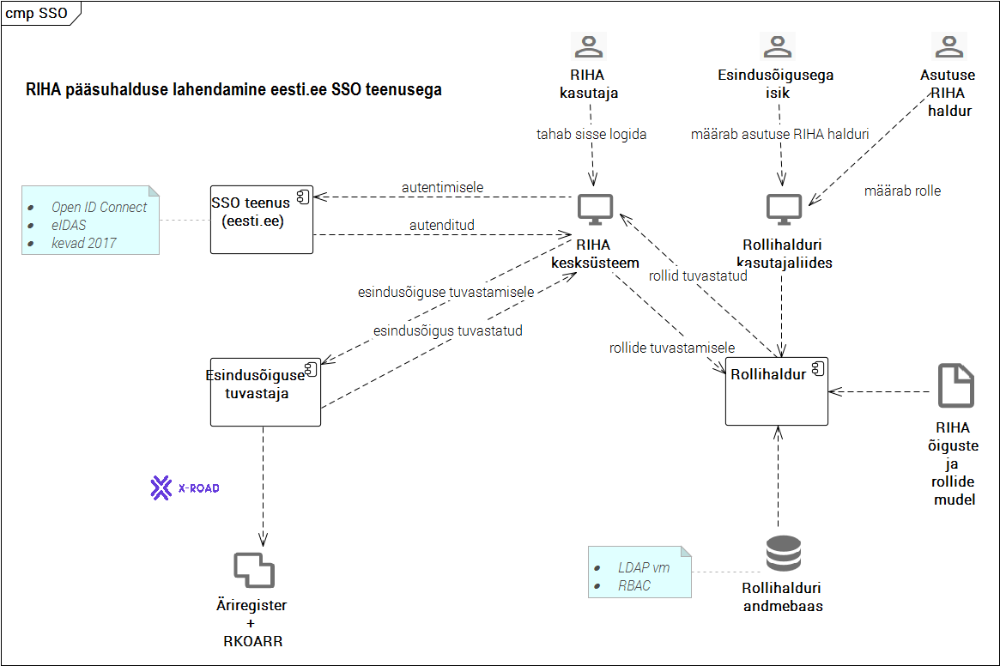

# RIHA pääsuhaldus

spetsifikatsioon

v0.1, 16.11.2016

Sisukord

- [1 Ülevaade](#1-käsitlusala)
- [2 Mõisted ja lühendid](#2-mõisted-ja-lühendid)
- [3 Olulised viited](#3-olulised-viited)
- [4 Vajadus](#4-vajadus)
- [5 Lahendus](#5-lahendus)

## 1 Käsitlusala

Pääsuhalduse korraldamine RIHA kesksüsteemis. Ei käsitleta pääsuhalduse korraldust lokaal-RIHAdes.

## 2 Mõisted ja lühendid

| mõiste | seletus |
|--------|---------|
| _RIHA kesksüsteem_ | RIA taristus käitatav, andmebaasist, REST API-st ja mitmetest kasutajaliidesega moodulitest RIHA hajuslahenduse keskne komponent |
| _lokaal-RIHA_ | RIHA kesksüsteemist eraldi paigutatud, asutuse enda kontrolli all olevad, _kirjeldused_ või neid kirjeldusi välja andvad API-d; neid API-sid realiseerivad tarkvararakendused; eraldi paigaldatud RIHA kirjeldusmoodul vm moodulid (kui neid peaks tulevikus tekkima) |
| _kirjeldus_ | RIHA kirjeldusstandardile vastav riigi infosüsteemi komponendi (nt infosüsteemi, teenuse, klassifikaatori vm) masintöödeldav kirjeldus |

## 3 Olulised viited

[RIHA üldvaade](https://github.com/e-gov/RIHA-API/blob/master/docs/YLDVAADE.md#riha-%C3%BCldvaade)

## 4 Vajadus

1. RIHA üldpõhimõte on teabe avatus. Siiski on vaja juurdepääsu piirata järgmises toimingutes:
  1. _kirjelduse_ koostamine, muutmine ja kustutamine
  2. _kooskõlastuse_ andmine
  3. piiratud juurdepääsuga teabe vaatamisel
  4. teiste kasutajate pääsuõiguste haldamisel (andmisel ja äravõtmisel)

## 5 Lahendus

5.1 __Piiratud juurdepääsuga teave__
- __Vanas RIHAs__ Vanas RIHAs on kesksüsteemi kogutud teabele juurdepääsu võimalik piirata. Mehhanism on keeruline ja halvasti läbipaistev. Juurdepääsu piiramist kasutatakse eelkõige kooskõlastajatele vajaliku, kuid väidetavalt avalikkuse eest kaitset vajavad teabe edastamiseks.
- __Turvaauditite raportid__ Eraldi vajadus on RIA soov koguda RIHAsse turvaauditite raporteid. See teave vajab kindlasti juurdepääsu piiramist.
- __Kaalutlused:__
  - juurdepääsupiiranguga teabe töötlus läheb vastuollu RIHA teabe avalikkuse üldpõhimõttega ja lisaks keerukust, sh kõrgemast turvaklassist tulenevat.
  - samas RIHA kontseptsioon platvormteenusena peaks võimaldama täita ka olulisi vajadusi, mis nõuavad juurdepääsupiiranguga teabe töötlemist.
- __Lahendus:_ Piiratud juurdepääsuga teabe töötlemine lahendada eraldi moodulina (esialgne nimetus "Turvateave").
  - moodul teostada teises järjekorras

Joonis 1 

  
